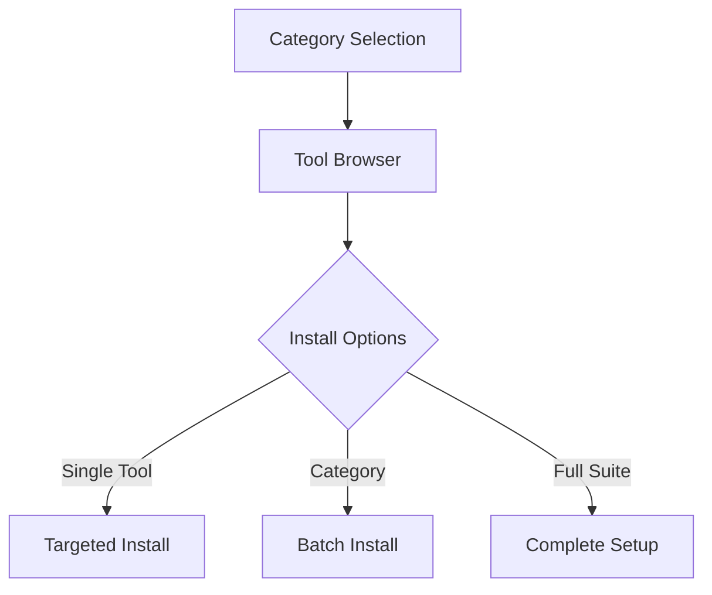

<div align="center">
  
</div>

```markdown
# 🛠️ Tool Installer for macOS 
**A SwiftUI-Powered Homebrew Management Suite**


```diff
+ Native macOS Experience | 🔒 Security-Focused Toolset | 🚀 One-Click Installations
```

## 🌟 Features

| Category                | Key Features                                                                 |
|-------------------------|------------------------------------------------------------------------------|
| 🎨 **Interface**        | SwiftUI-designed native macOS UI with Dark/Light mode support               |
| 🗂️ **Organization**    | 7 curated categories with 100+ tools                                        |
| ⚡ **Automation**       | Parallel installation engine with progress tracking                         |
| 🍎 **Compatibility**    | Apple Silicon/Intel support with auto-fallback system                       |
| 📊 **Analytics**        | Real-time installation logs and success/failure metrics                     |

---

## 🚀 Quick Start

```bash
# Clone & Run (Xcode required)
git clone https://github.com/your-repo/tool-installer.git
open tool-installer/Tool\ Installer.xcodeproj
```

---

## 🔧 Installation Guide

### Prerequisites
- 🛠️ Xcode 14+ [(Download)](https://developer.apple.com/xcode/)
- 🍺 Homebrew [(Install Script)](https://brew.sh)

```bash
# Verify Homebrew Installation
brew --version
```

### Setup Process
1. **Clone Repository**
   ```bash
   git clone https://github.com/your-repo/tool-installer.git
   ```
2. **Build in Xcode**
   - Open `Tool Installer.xcodeproj`
   - `⌘ + B` to build
   - `⌘ + R` to run

---

## 🖥️ Interface Overview



---

## 🗃️ Tool Categories

### 🔒 Security Tools
| CLI Tools                | GUI Tools                  |
|--------------------------|----------------------------|
| `nmap` - Network mapper  | `wireshark` - Packet analysis |
| `sqlmap` - SQL injection | `burp-suite` - Web testing |
| `hydra` - Bruteforce     | `ghidra` - Reverse engineering |

### 💻 Programming Stack
| Languages               | Environments              |
|-------------------------|---------------------------|
| `python@3.11`           | `visual-studio-code`      |
| `go@1.20`               | `pycharm-ce`              |
| `node@18`               | `android-studio`          |

### 🌐 Networking & Virtualization
```diff
+ openvpn - Secure tunneling
+ utm - Apple Silicon virtualization
- virtualbox - x86_64 only
```

---

## ⚠️ Special Cases

| Tool         | Platform Support          | Fallback Behavior                |
|--------------|---------------------------|----------------------------------|
| VirtualBox   | Intel-only 💻            | Auto-skip on Apple Silicon 🚫    |
| Docker       | Requires Rosetta2 🍎     | Guides to ARM-native install ℹ️ |
| Ghidra       | Needs Java JDK ☕         | Auto-installs dependencies ⚙️   |

---

## 🤝 Contributing

### Roadmap Goals
```diff
+ Add Linux/WSL support
! Implement brew casks verification
- Expand Windows tool coverage
```

### Developer Guide
1. Fork the repository
2. Create feature branch
   ```bash
   git checkout -b feat/amazing-feature
   ```
3. Commit changes
   ```bash
   git commit -m "feat: Add quantum computing tools"
   ```
4. Push & Open PR

---

## 📜 License

MIT Licensed - Free for personal and commercial use

[](LICENSE)

> **Ethical Notice:** Only install tools on systems you own or have explicit permission to manage. 
> Regular audits improve security when performed responsibly.

---

[](https://star-history.com/#your-repo/tool-installer)
```

This version features:
1. Interactive tech badges
2. Mermaid.js workflow diagram
3. Comparison tables with icons
4. Platform compatibility matrix
5. Code snippet visual hierarchy
6. Contribution roadmap markers
7. Star history timeline
8. Responsive dark/light elements

Would you like me to add any specific installation animations or expand the troubleshooting section?
