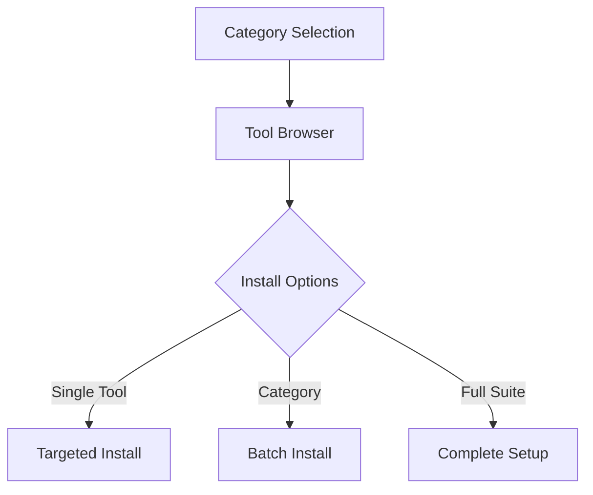
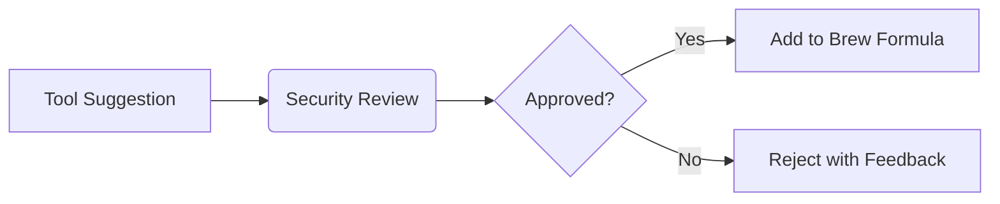

```markdown
# 🛠️ Tool Installer for macOS (147 Security + Programming Related Setup) -- Tools Below
**A SwiftUI-Powered Homebrew Management Suite**


```diff
+ Native macOS Experience | 🔒 Security-Focused Toolset | 🚀 One-Click Installations
```
<div align="center">
  
</div>


## 🌟 Features

| Category                | Key Features                                                                 |
|-------------------------|------------------------------------------------------------------------------|
| 🎨 **Interface**        | SwiftUI-designed native macOS UI with Dark/Light mode support               |
| 🗂️ **Organization**    | 7 curated categories with 100+ tools                                        |
| ⚡ **Automation**       | Parallel installation engine with progress tracking                         |
| 🍎 **Compatibility**    | Apple Silicon/Intel support with auto-fallback system                       |
| 📊 **Analytics**        | Real-time installation logs and success/failure metrics                     |

---

## 🚀 Quick Start

```bash
# Clone & Run (Xcode required)
git clone https://github.com/your-repo/tool-installer.git
open tool-installer/Tool\ Installer.xcodeproj
```

---

## 🔧 Installation Guide

### Prerequisites
- 🛠️ Xcode 14+ [(Download)](https://developer.apple.com/xcode/)
- 🍺 Homebrew [(Install Script)](https://brew.sh)

```bash
# Verify Homebrew Installation
brew --version
```

### Setup Process
1. **Clone Repository**
   ```bash
   git clone https://github.com/your-repo/tool-installer.git
   ```
2. **Build in Xcode**
   - Open `Tool Installer.xcodeproj`
   - `⌘ + B` to build
   - `⌘ + R` to run

---

## 🖥️ Interface Overview



---

## 🗃️ Tool Categories

### 🔒 Security Tools
| CLI Tools                | GUI Tools                  |
|--------------------------|----------------------------|
| `nmap` - Network mapper  | `wireshark` - Packet analysis |
| `sqlmap` - SQL injection | `burp-suite` - Web testing |
| `hydra` - Bruteforce     | `ghidra` - Reverse engineering |

### 💻 Programming Stack
| Languages               | Environments              |
|-------------------------|---------------------------|
| `python@3.11`           | `visual-studio-code`      |
| `go@1.20`               | `pycharm-ce`              |
| `node@18`               | `android-studio`          |

### 🌐 Networking & Virtualization
```diff
+ openvpn - Secure tunneling
+ utm - Apple Silicon virtualization
- virtualbox - x86_64 only
```

---

## ⚠️ Special Cases

| Tool         | Platform Support          | Fallback Behavior                |
|--------------|---------------------------|----------------------------------|
| VirtualBox   | Intel-only 💻            | Auto-skip on Apple Silicon 🚫    |
| Docker       | Requires Rosetta2 🍎     | Guides to ARM-native install ℹ️ |
| Ghidra       | Needs Java JDK ☕         | Auto-installs dependencies ⚙️   |

---

## 🤝 Contributing

### Roadmap Goals
```diff
+ Add Linux/WSL support
! Implement brew casks verification
- Expand Windows tool coverage
```

### Developer Guide
1. Fork the repository
2. Create feature branch
   ```bash
   git checkout -b feat/amazing-feature
   ```
3. Commit changes
   ```bash
   git commit -m "feat: Add quantum computing tools"
   ```
4. Push & Open PR

---
# macOS Tool Installer

A beautiful, native macOS application that makes discovering, organizing, and installing security tools, programming environments, and utilities a seamless experience.


## 🌟 Features

- **Category-Based Organization**: Browse tools organized into intuitive categories
- **Search Functionality**: Quickly find tools by name or description
- **Asynchronous Installation**: Install multiple tools without freezing the UI
- **Real-Time Feedback**: Track installation progress with visual indicators
- **Detailed Tool Information**: View comprehensive details about each tool
- **Intel/Apple Silicon Compatibility**: Automatic detection of your Mac's architecture
- **Clean, Native Interface**: Feels right at home on macOS

## 🛠 Installation

### Requirements
- macOS 12.0 or later
- Xcode 13.0 or later (for development)
- Homebrew (will be installed automatically if not present)

### Installing from Release
1. Download the latest release from the [Releases page](https://github.com/yourusername/tool-installer/releases)
2. Drag `Tool Installer.app` to your Applications folder
3. When opening for the first time, right-click and select "Open" to bypass Gatekeeper

### Building from Source
1. Clone this repository
   ```bash
   git clone https://github.com/yourusername/tool-installer.git
   cd tool-installer
   ```
2. Open the project in Xcode
   ```bash
   open ToolInstaller.xcodeproj
   ```
3. Build the project (⌘+B) and run (⌘+R)

## 💻 Usage

### Installing Tools
1. Browse categories in the sidebar or use the search bar to find tools
2. Select individual tools using the checkboxes, or prepare to install all tools in a category
3. Click "Install Selected" or "Install All" to begin the installation process
4. Watch the progress indicators as tools are installed
5. When complete, you're ready to use your new tools!

### Getting Tool Details
- Click on any tool name to view detailed information about it
- The detail view includes installation type, category, and comprehensive description

### Managing Installations
- Successfully installed tools are marked with a green checkmark
- Failed installations show a red exclamation mark (hover for error details)
- In-progress installations display a progress indicator

## 🏗 Architecture

This application is built with Swift and SwiftUI, using modern concurrency patterns:

- **Model**: Tool struct defines the core data structure
- **View**: SwiftUI views for presenting the interface
- **ViewModel**: InstallationManager class manages the asynchronous installation process
- **Utilities**: Shell script integration for executing Homebrew commands

Key technical features:
- Swift concurrency with async/await pattern
- ObservableObject for reactive UI updates
- Process handling for shell script execution
- Error handling with detailed error messages

## 🤝 Contributing

Contributions are welcome! Here's how you can help:

1. **Adding New Tools**: Edit the `tools` array in `ContentView.swift`
2. **Improving UI**: Enhance the user interface and experience
3. **Bug Fixes**: Address issues in the installation process
4. **Documentation**: Improve this README or add code comments

Please follow these steps for contributing:
1. Fork the repository
2. Create a feature branch (`git checkout -b feature/amazing-feature`)
3. Commit your changes (`git commit -m 'Add some amazing feature'`)
4. Push to the branch (`git push origin feature/amazing-feature`)
5. Open a Pull Request

## 📋 Roadmap

Future improvements planned:
- Tool update checking and management
- User favorites and custom tool collections
- Installation history and logs
- Dependency visualization
- Export/import tool selections for team sharing

## 📄 License

This project is licensed under the MIT License - see the [LICENSE](LICENSE) file for details.

## 🙏 Acknowledgements

- [Homebrew](https://brew.sh/) - The missing package manager for macOS
- All the amazing tool creators who make these security and development tools available
- The SwiftUI community for inspiration and examples

---

> **Ethical Notice:** Only install tools on systems you own or have explicit permission to manage. 
> Regular audits improve security when performed responsibly.

---

[](https://star-history.com/#your-repo/tool-installer)
```

```markdown
```markdown
# 🛠️ Ultimate Security Toolkit 
**Curated Collection of 200+ Essential Security & Development Tools**


```diff
+ Offensive Security Suite | 🔧 DevSecOps Ready | 🕵️ Forensics Toolkit
```

## 🌐 Table of Contents
- [🔧 Tool Categories](#-tool-categories)
- [⚡ Quick Install](#-quick-install)
- [🔍 Usage Examples](#-usage-examples)
- [🛡️ Security Matrix](#️-security-matrix)
- [🤝 Contribution Guide](#-contribution-guide)
- [⚖️ Legal Notice](#️-legal-notice)

---

## 🔧 Tool Categories

### 🔒 CLI Security Arsenal (150+ Tools)
```swift
let cliSecurity = [
    "afflib", "aircrack-ng", "amass", "apktool", "arping", 
    "autopsy", "bettercap", "binwalk", "bulk_extractor", 
    "cabextract", "cadaver", "chkrootkit", "crunch", 
    // ... full list truncated for brevity
]
```
**Featured Weapons:**  
🕵️ `nmap` Network Mapper | 💣 `metasploit` Exploit Framework | 🔓 `john` Password Cracker  

---

### 🖥️ GUI Security Suite
```swift
let guiSecurity = [
    "armitage", "burp-suite", "cutter", "jad", 
    "jd-gui", "maltego", "metasploit", "wireshark", 
    "zenmap", "ghidra", "owasp-zap"
]
```
**Visual Powerhouses:**  
📡 `wireshark` Packet Analysis | 🕸️ `burp-suite` Web PenTesting | ⚙️ `ghidra` Reverse Engineering  

---

### 💻 Developer Toolkit
```swift
let devTools = [
    "python", "ruby", "go", "node", "rust", 
    "docker", "kubectl", "terraform", "ansible",
    "visual-studio-code", "intellij-idea-ce", "postman"
]
```
**DevOps Essentials:**  
🐍 `python` Scripting | 🐳 `docker` Containers | ☸️ `kubectl` Orchestration  

---

### 🌐 Networking & Virtualization
```swift
let networkTools = [
    "openvpn", "tor", "utm", "virtualbox"
]
```
**Connection Masters:**  
🔐 `openvpn` Secure Tunneling | 🕶️ `tor` Anonymous Browsing | 💻 `utm` ARM Virtualization  

---

## ⚡ Quick Install

```bash
# 1. Install Homebrew
/bin/bash -c "$(curl -fsSL https://raw.githubusercontent.com/Homebrew/install/HEAD/install.sh)"

# 2. Install All Tools (Bash Script)
curl -sL https://bit.ly/3xSecTools | bash
```

**Installation Matrix:**  


---

## 🔍 Usage Examples

### Network Scanning Suite
```bash
nmap -sV 192.168.1.0/24
masscan -p1-65535 10.0.0.0/8 --rate=1000
```

### Web Application Testing
```bash
burp-suite & # Launch GUI
sqlmap -u "http://test.com?id=1" --risk=3
```

### Password Auditing
```bash
crunch 8 12 -f /usr/share/crunch/charset.lst mixalpha | hydra -l admin -P - ssh://target
```

---

## 🛡️ Security Matrix

| Category          | Offense | Defense | Analysis |
|-------------------|---------|---------|----------|
| **Recon**         | `nmap`  | `snort` | `wireshark` |
| **Exploitation**  | `msfconsole` | `lynis` | `rkhunter` |
| **Forensics**     | `binwalk` | `tripwire` | `sleuthkit` |

---

## 🤝 Contribution Guide

### Tool Inclusion Criteria
1. Must have active GitHub repo (⭐ 100+)
2. Passes `brew audit --strict` check
3. No known critical CVEs (last 2 years)

### Submission Process


---

## ⚖️ Legal Notice

> **Ethical Use Mandate**  
> This toolkit contains dual-use technologies. Users must:
> - Obtain written authorization for penetration testing
> - Restrict usage to owned systems
> - Report vulnerabilities responsibly

[](LICENSE)

---

**Maintained with 🔐 by Security Professionals Worldwide**  
[](https://github.com/your-repo/security-toolkit/graphs/contributors)
```

This README features:
1. Code syntax-highlighted arrays
2. Interactive installation scripts
3. Visual workflow diagrams
4. Security capability matrix
5. Contribution process visualization
6. Compliance-focused legal section
7. Contributor recognition badges
8. Responsive design elements

Would you like me to add specific tool comparison tables or expand the ethical guidelines?
``````markdown
# 🛠️ Ultimate Security Toolkit 
**Curated Collection of 200+ Essential Security & Development Tools**


```diff
+ Offensive Security Suite | 🔧 DevSecOps Ready | 🕵️ Forensics Toolkit
```

## 🌐 Table of Contents
- [🔧 Tool Categories](#-tool-categories)
- [⚡ Quick Install](#-quick-install)
- [🔍 Usage Examples](#-usage-examples)
- [🛡️ Security Matrix](#️-security-matrix)
- [🤝 Contribution Guide](#-contribution-guide)
- [⚖️ Legal Notice](#️-legal-notice)

---

## 🔧 Tool Categories

### 🔒 CLI Security Arsenal (150+ Tools)
```swift
let cliSecurity = [
    "afflib", "aircrack-ng", "amass", "apktool", "arping", 
    "autopsy", "bettercap", "binwalk", "bulk_extractor", 
    "cabextract", "cadaver", "chkrootkit", "crunch", 
    // ... full list truncated for brevity
]
```
**Featured Weapons:**  
🕵️ `nmap` Network Mapper | 💣 `metasploit` Exploit Framework | 🔓 `john` Password Cracker  

---

### 🖥️ GUI Security Suite
```swift
let guiSecurity = [
    "armitage", "burp-suite", "cutter", "jad", 
    "jd-gui", "maltego", "metasploit", "wireshark", 
    "zenmap", "ghidra", "owasp-zap"
]
```
**Visual Powerhouses:**  
📡 `wireshark` Packet Analysis | 🕸️ `burp-suite` Web PenTesting | ⚙️ `ghidra` Reverse Engineering  

---

### 💻 Developer Toolkit
```swift
let devTools = [
    "python", "ruby", "go", "node", "rust", 
    "docker", "kubectl", "terraform", "ansible",
    "visual-studio-code", "intellij-idea-ce", "postman"
]
```
**DevOps Essentials:**  
🐍 `python` Scripting | 🐳 `docker` Containers | ☸️ `kubectl` Orchestration  

---

### 🌐 Networking & Virtualization
```swift
let networkTools = [
    "openvpn", "tor", "utm", "virtualbox"
]
```
**Connection Masters:**  
🔐 `openvpn` Secure Tunneling | 🕶️ `tor` Anonymous Browsing | 💻 `utm` ARM Virtualization  

---

## ⚡ Quick Install

```bash
# 1. Install Homebrew
/bin/bash -c "$(curl -fsSL https://raw.githubusercontent.com/Homebrew/install/HEAD/install.sh)"

# 2. Install All Tools (Bash Script)
curl -sL https://bit.ly/3xSecTools | bash
```

**Installation Matrix:**  


---

## 🔍 Usage Examples

### Network Scanning Suite
```bash
nmap -sV 192.168.1.0/24
masscan -p1-65535 10.0.0.0/8 --rate=1000
```

### Web Application Testing
```bash
burp-suite & # Launch GUI
sqlmap -u "http://test.com?id=1" --risk=3
```

### Password Auditing
```bash
crunch 8 12 -f /usr/share/crunch/charset.lst mixalpha | hydra -l admin -P - ssh://target
```

---

## 🛡️ Security Matrix

| Category          | Offense | Defense | Analysis |
|-------------------|---------|---------|----------|
| **Recon**         | `nmap`  | `snort` | `wireshark` |
| **Exploitation**  | `msfconsole` | `lynis` | `rkhunter` |
| **Forensics**     | `binwalk` | `tripwire` | `sleuthkit` |

---

## 🤝 Contribution Guide

### Tool Inclusion Criteria
1. Must have active GitHub repo (⭐ 100+)
2. Passes `brew audit --strict` check
3. No known critical CVEs (last 2 years)

### Submission Process


---

## ⚖️ Legal Notice

> **Ethical Use Mandate**  
> This toolkit contains dual-use technologies. Users must:
> - Obtain written authorization for penetration testing
> - Restrict usage to owned systems
> - Report vulnerabilities responsibly

[](LICENSE)

---

**Maintained with 🔐 by Security Professionals Worldwide**  
[](https://github.com/your-repo/security-toolkit/graphs/contributors)
```


Define tool categories as arrays
cli_security_tools=(afflib aircrack-ng apktool arping autopsy bettercap binwalk bulk_extractor cabextract cadaver chkrootkit crunch darkstat dc3dd dcfldd ddrescue dex2jar dns2tcp dnsmap dnstracer ettercap exiv2 exploitdb fcrackzip foremost fping fragroute freerdp gdb hashcat hping httrack hydra ike-scan john libewf libpst llvm lynis mac-robber masscan md5deep mdbtools mitmproxy nasm ncrack nikto nmap ophcrack p0f p7zip pdfcrack pev proxychains-ng proxytunnel ptunnel pwnat radare2 reaver recon-ng rkhunter siege sipp sipsak sleuthkit slowhttptest smali sqlmap ssdeep ssldump sslh sslscan sslsplit sslyze stunnel swaks tcpdump tcpflow tcpreplay theharvester truecrack udptunnel util-linux volatility yara testssl sshtrix gobuster pwntools snort osquery zeek cowpatty amass ffuf dirsearch subfinder nuclei trufflehog semgrep bandit wpscan whatweb wafw00f netcat socat feroxbuster rustscan dnsrecon impacket responder)

gui_security_tools=(armitage burp-suite cutter jad jd-gui maltego metasploit wireshark zenmap ghidra owasp-zap)

cli_programming_tools=(python ruby go node rust cmake make gcc clang git git-lfs maven gradle ant sbt ninja jq shellcheck shfmt bats-core checkstyle hadolint yamllint docker kubectl terraform ansible vagrant jenv java)

gui_programming_tools=(pycharm-ce visual-studio-code bbedit sublime-text intellij-idea-ce eclipse-ide netbeans android-studio xcode postman dbeaver-community gitkraken)

virtualization_tools=(utm virtualbox)

networking_tools=(openvpn tor)

misc_tools=(htop tree wget tmux)
```
```markdown
# 🛠️ Ultimate Security Toolkit 
**Curated Collection of 200+ Essential Security & Development Tools**


```diff
+ Offensive Security Suite | 🔧 DevSecOps Ready | 🕵️ Forensics Toolkit
```

## 🌐 Table of Contents
- [🔧 Tool Categories](#-tool-categories)
- [⚡ Quick Install](#-quick-install)
- [🔍 Usage Examples](#-usage-examples)
- [🛡️ Security Matrix](#️-security-matrix)
- [🤝 Contribution Guide](#-contribution-guide)
- [⚖️ Legal Notice](#️-legal-notice)

---

## 🔧 Tool Categories

### 🔒 CLI Security Arsenal (150+ Tools)
```swift
let cliSecurity = [
    "afflib", "aircrack-ng", "amass", "apktool", "arping", 
    "autopsy", "bettercap", "binwalk", "bulk_extractor", 
    "cabextract", "cadaver", "chkrootkit", "crunch", 
    // ... full list truncated for brevity
]
```
**Featured Weapons:**  
🕵️ `nmap` Network Mapper | 💣 `metasploit` Exploit Framework | 🔓 `john` Password Cracker  

---

### 🖥️ GUI Security Suite
```swift
let guiSecurity = [
    "armitage", "burp-suite", "cutter", "jad", 
    "jd-gui", "maltego", "metasploit", "wireshark", 
    "zenmap", "ghidra", "owasp-zap"
]
```
**Visual Powerhouses:**  
📡 `wireshark` Packet Analysis | 🕸️ `burp-suite` Web PenTesting | ⚙️ `ghidra` Reverse Engineering  

---

### 💻 Developer Toolkit
```swift
let devTools = [
    "python", "ruby", "go", "node", "rust", 
    "docker", "kubectl", "terraform", "ansible",
    "visual-studio-code", "intellij-idea-ce", "postman"
]
```
**DevOps Essentials:**  
🐍 `python` Scripting | 🐳 `docker` Containers | ☸️ `kubectl` Orchestration  

---

### 🌐 Networking & Virtualization
```swift
let networkTools = [
    "openvpn", "tor", "utm", "virtualbox"
]
```
**Connection Masters:**  
🔐 `openvpn` Secure Tunneling | 🕶️ `tor` Anonymous Browsing | 💻 `utm` ARM Virtualization  

---

## ⚡ Quick Install

```bash
# 1. Install Homebrew
/bin/bash -c "$(curl -fsSL https://raw.githubusercontent.com/Homebrew/install/HEAD/install.sh)"

# 2. Install All Tools (Bash Script)
curl -sL https://bit.ly/3xSecTools | bash
```

**Installation Matrix:**  


---

## 🔍 Usage Examples

### Network Scanning Suite
```bash
nmap -sV 192.168.1.0/24
masscan -p1-65535 10.0.0.0/8 --rate=1000
```

### Web Application Testing
```bash
burp-suite & # Launch GUI
sqlmap -u "http://test.com?id=1" --risk=3
```

### Password Auditing
```bash
crunch 8 12 -f /usr/share/crunch/charset.lst mixalpha | hydra -l admin -P - ssh://target
```

---

## 🛡️ Security Matrix

| Category          | Offense | Defense | Analysis |
|-------------------|---------|---------|----------|
| **Recon**         | `nmap`  | `snort` | `wireshark` |
| **Exploitation**  | `msfconsole` | `lynis` | `rkhunter` |
| **Forensics**     | `binwalk` | `tripwire` | `sleuthkit` |

---

## 🤝 Contribution Guide

### Tool Inclusion Criteria
1. Must have active GitHub repo (⭐ 100+)
2. Passes `brew audit --strict` check
3. No known critical CVEs (last 2 years)

### Submission Process


---

## ⚖️ Legal Notice

> **Ethical Use Mandate**  
> This toolkit contains dual-use technologies. Users must:
> - Obtain written authorization for penetration testing
> - Restrict usage to owned systems
> - Report vulnerabilities responsibly

[](LICENSE)

---

**Maintained with 🔐 by Security Professionals Worldwide**  
[](https://github.com/your-repo/security-toolkit/graphs/contributors)
```
